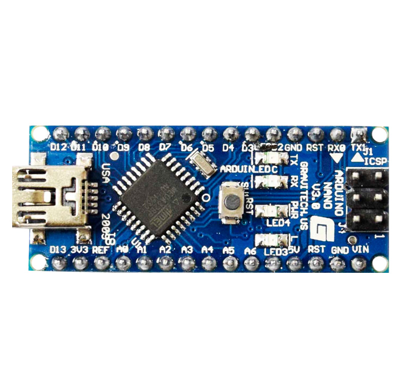
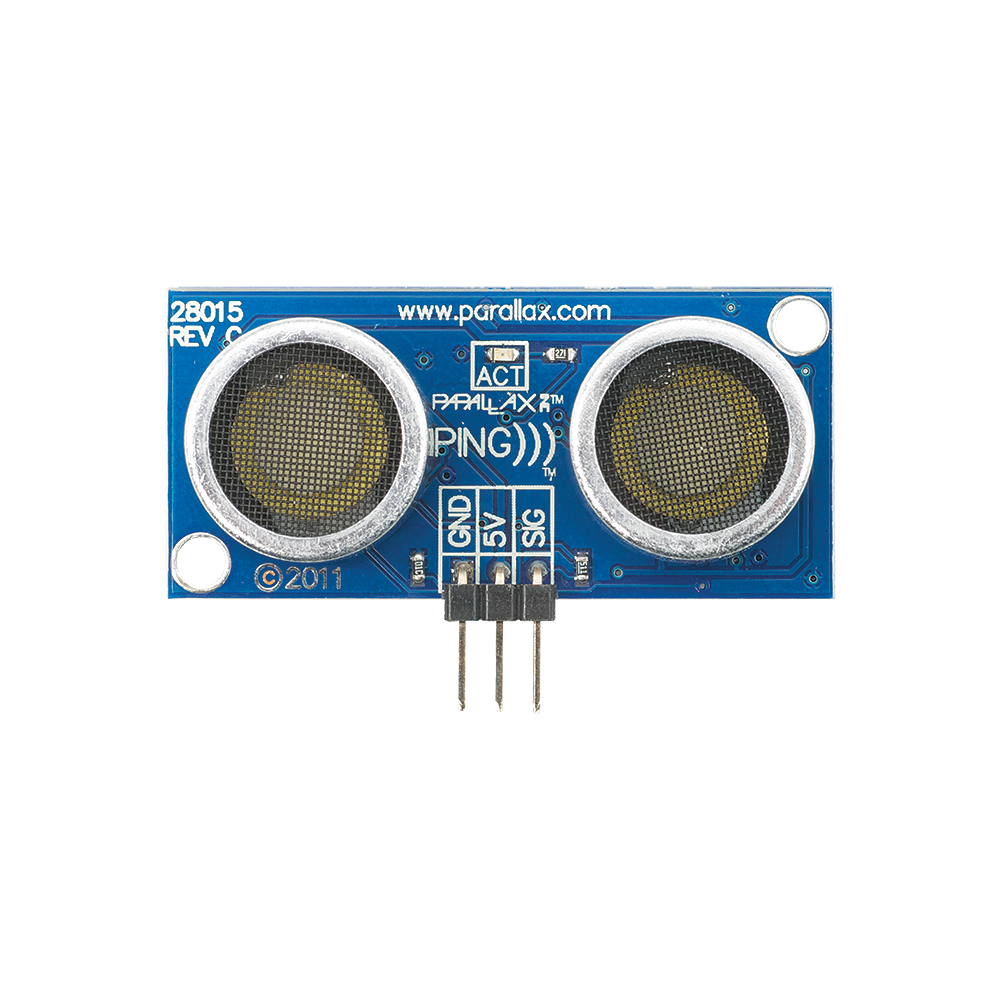
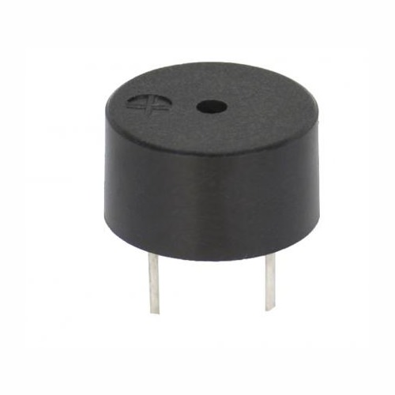
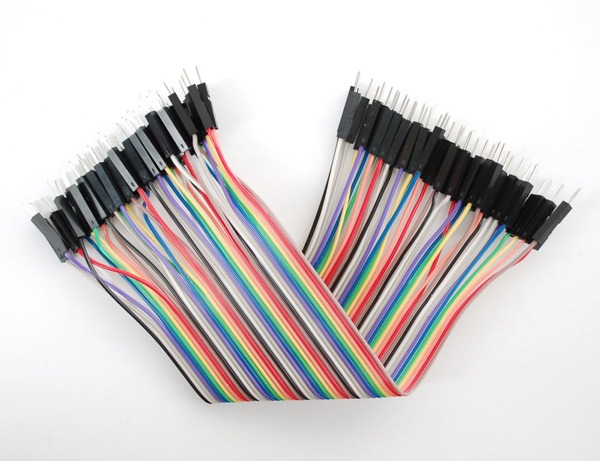
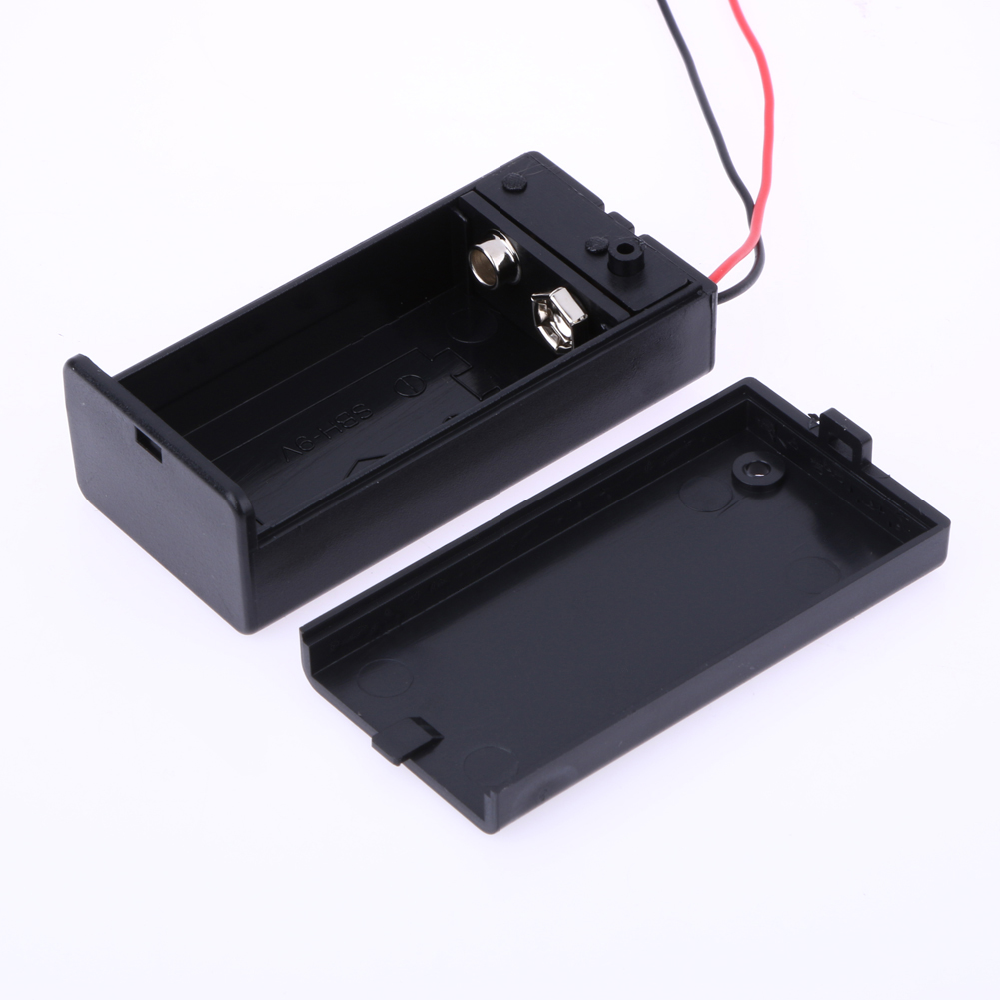
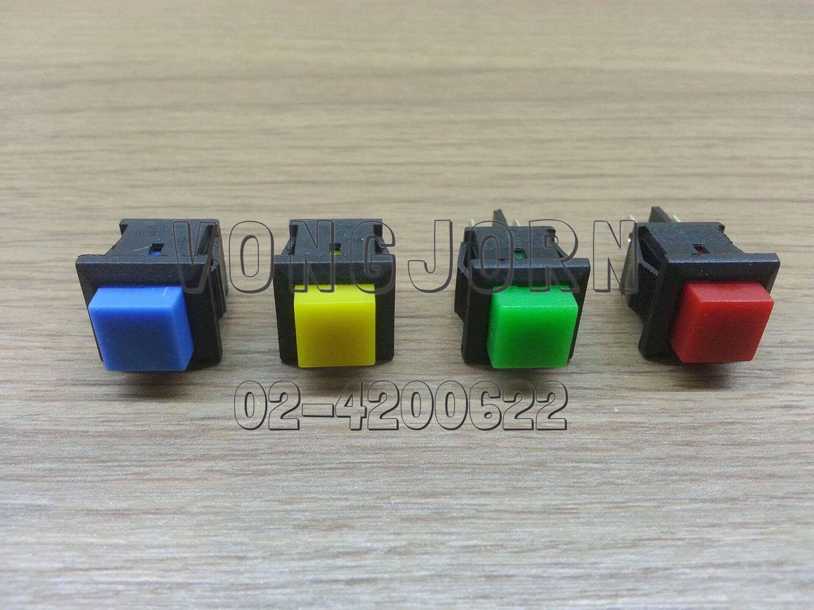
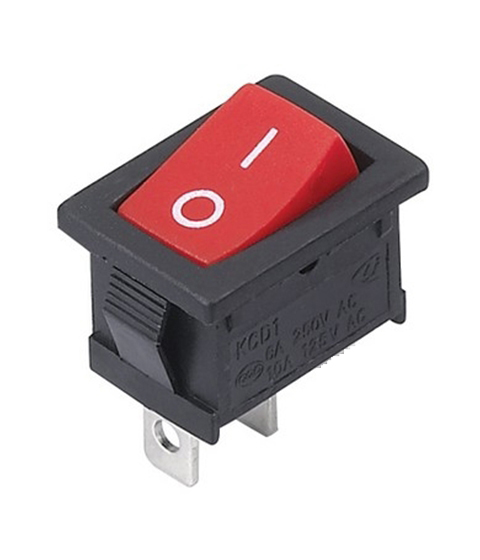
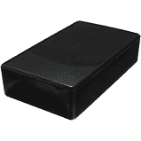
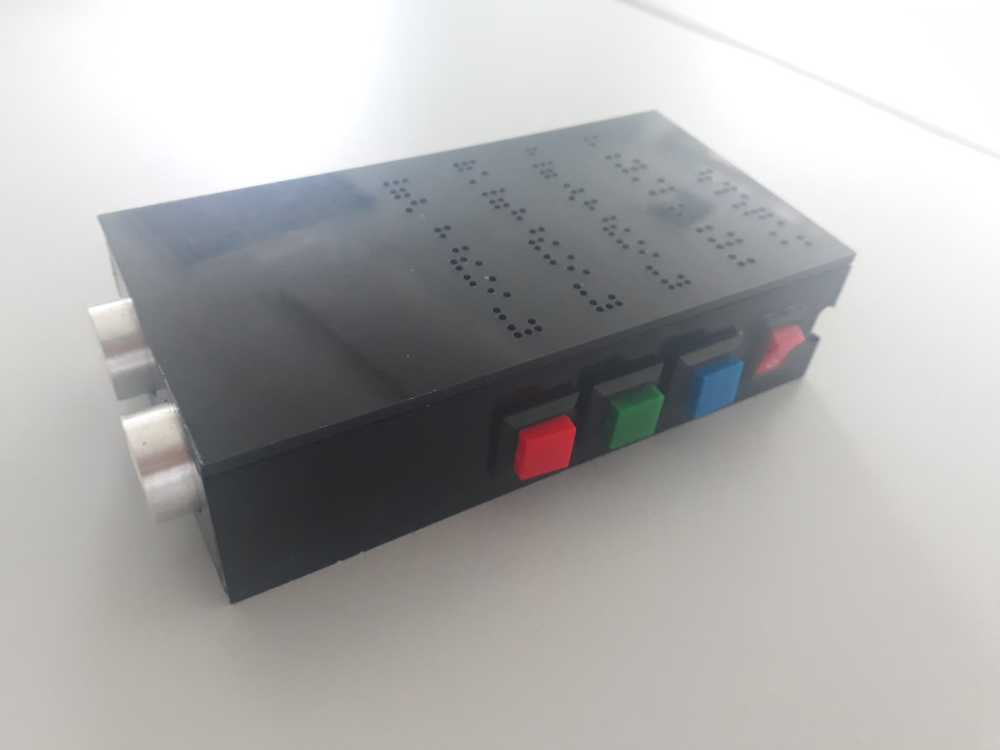

#  Detector-For-The-Blind
# จุดเริ่มต้นของการพัฒนาเทคโนโลยีเพื่อผู้พิการทางสายตา

## :speaker: Introduction | บทนำ :speaker:
เนื่องจากมีผู้คนจำนวนไม่น้อยที่พิการทางสายตา ซึ่งทำให้การทำกิจกรรมต่างๆนั้นมีความยากลำบากไม่ว่าจะเป็นการทำกิจกรรมในบ้านเช่น เข้าห้องน้ำ หยิบของ เป็นต้น หรือกิจกรรมนอกบ้านเช่น เดินข้างทาง ขึ้นรถ เป็นต้น พวกเราจึงคิดอุปกรณ์มาเพื่ออำนวยความสะดวกผู้พิการทางสายตา

---

## 💻 Equipment and Devices | อุปกรณ์ 💻

| Arduino nano	 | Ultrasonic sensors | Buzzer | Wires |
| :--------: | :--------: | :--------: | :--------: | 
|      |   |      |      | 

| 9V Battery | 9V Battery Box | Button | Switch | Box |
| :--------: | :--------: | :--------: | :--------: | :--------: |  
|     |     |   |  |  |

---

## :pencil2: Language | ภาษาที่ใช้ :pencil2:

| Arduino IDE |
| :--------: |
| |

---

## 🔌 How to use | วิธีการใช้ 🔌

| หน้าตาของอุปกรณ์ |
| :----------------: |
 |

### สามารถดูการใช้งานได้ที่นี้เลย ====> [คลิกเพื่อดูการใช้งาน](https://youtu.be/yRW2DmuzaIE).

---

## :boy: Our Team | สมาชิกกลุ่ม :boy:
| ชื่อ-นามสกุล       | รหัสนักศึกษา |
| :-------------: |:----------:|
| ธนวัฒน์ พุฒจีบ | 61070076 |
| พัทธพล ยางกิจวิบูลย์ | 61070138 |
| พุฒินาท สุจริตกิตติกุล | 61070150 |
| ศิรพัชร นาคะรัตนากร | 61070219 |

---

## 🎓 Instructor | อาจารย์ที่ปรึกษา 🎓
| ชื่อ-นามสกุล |
| :-------------: |
| ผศ. ดร. กิติ์สุชาต พสุภา |
| ผศ. ดร. ปานวิทย์ ธุวะนุติ |

---

## :school_satchel: Computer Programming (รหัส 06016315) :school_satchel:

- Faculty of Information Technology 
- King Mongkut's Institute of Technology  (KMITL)
